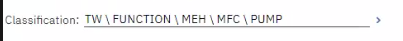
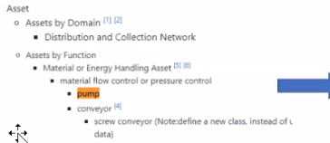
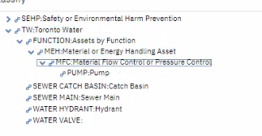

### [[🤝🏻meeting note]]
initiative::
notable-attendees:: [[Silvia]]
	- Debbie's Implementation of my Asset Schema into Maximo
		- Rule: Linear will overwrite the asset ID auto generation (TWAG)
		- Interesting fact Silvia raised: There will be assets that linear want to complete the work right away, they want to create asset they discover in the WMS first, and have added to TWAG.
			- Me: we need 2-way integration.
		- I have noticed that in the classification breadcrumb, some classes must appear as acronyms, but in the tree, you can see the full name.
			- 
			- 
			- 
	- For next meeting
		- Reviews Debbie's questions
		  :LOGBOOK:
		  CLOCK: [2023-09-14 Thu 22:39:05]
		  :END:
			- DONE Try to review the concept before hand
			  :LOGBOOK:
			  CLOCK: [2023-09-14 Thu 22:42:08]--[2023-09-18 Mon 17:25:51] =>  90:43:43
			  :END:
		- Debbie will take up the concept of rotating asset, because she thinks that it is important.
			- DONE Try to review the concept of rotating asset before Debbie's presentation
			  :LOGBOOK:
			  CLOCK: [2023-09-14 Thu 22:42:19]
			  CLOCK: [2023-09-14 Thu 22:42:25]--[2023-09-25 Mon 15:14:58] =>  256:32:33
			  :END: