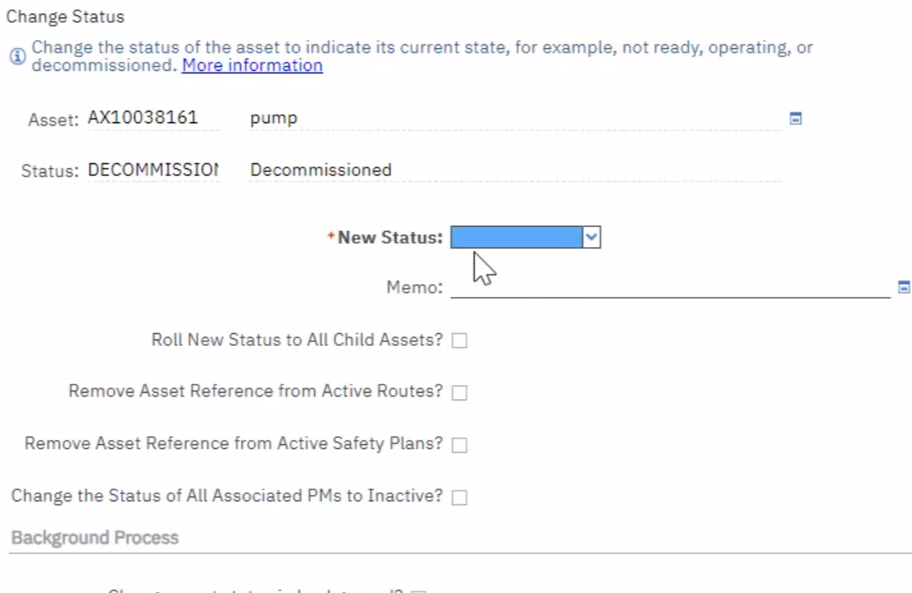
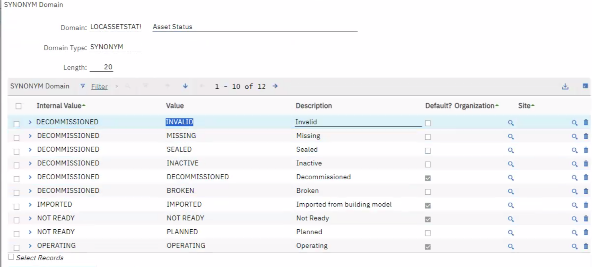

### [[🤝🏻meeting note]]
initiative::
notable-attendees::
	- NOW During meeting, I have noticed that asset description does not work for building asset - they don't have product-line information, I will need to re-specify some more nuanced asset description validation rules
	  :LOGBOOK:
	  CLOCK: [2023-09-18 Mon 17:26:11]
	  CLOCK: [2023-09-18 Mon 17:26:20]
	  :END:
	- We discussed, without reaching a general conclusion, whether the following data-fields should be Maximo Record Level Attribute or Class Level Specifications
		- product-line information (mfr, model, catalog number)
			- During the meeting, we have tentatively decided to put product-line into specification. After a later discussion with Debbie on [[Sep 19th, 2023]], we had decided
				- ((6509c9d1-c03e-4ee8-9c38-032359176b4c))
		- year built
			- DONE need to be revised from "year manufactured", currently in the schema, to "year built"
			  :LOGBOOK:
			  CLOCK: [2023-09-18 Mon 17:31:04]--[2023-09-19 Tue 12:31:03] =>  18:59:59
			  :END:
	- Other actions
		- DONE ensure that schema describes that first day of operation is being captured in the commissioning WO
		  :LOGBOOK:
		  CLOCK: [2023-09-18 Mon 17:38:25]
		  CLOCK: [2023-09-18 Mon 17:38:27]
		  CLOCK: [2023-09-18 Mon 17:38:45]--[2023-09-19 Tue 12:31:10] =>  18:52:25
		  :END:
			- Closing comment: This will be taken care of, when we are addressing the identified use-case of asset tracking.
		- DONE Discuss with George, how should records that represents lost asset or asset that was never installed be represented in the status drop-down (see clips below)
		  id:: 6509b39d-12e0-4951-80ca-f39b2b2191db
		  :LOGBOOK:
		  CLOCK: [2023-09-18 Mon 17:40:51]
		  CLOCK: [2023-09-18 Mon 17:40:54]--[2023-09-25 Mon 15:12:41] =>  165:31:47
		  CLOCK: [2023-09-25 Mon 15:12:45]
		  :END:
		- NOW Discuss with GI: make decision on what we should call ghost records ("purged" was suggested).
		  :LOGBOOK:
		  CLOCK: [2023-09-18 Mon 17:43:09]
		  CLOCK: [2023-09-18 Mon 17:43:13]
		  :END:
			- [[Sep 19th, 2023]]
				- TH: how about "deleted"
		-
	- Screen Clips
		- {:height 359, :width 594}
		- {:height 282, :width 595}
-