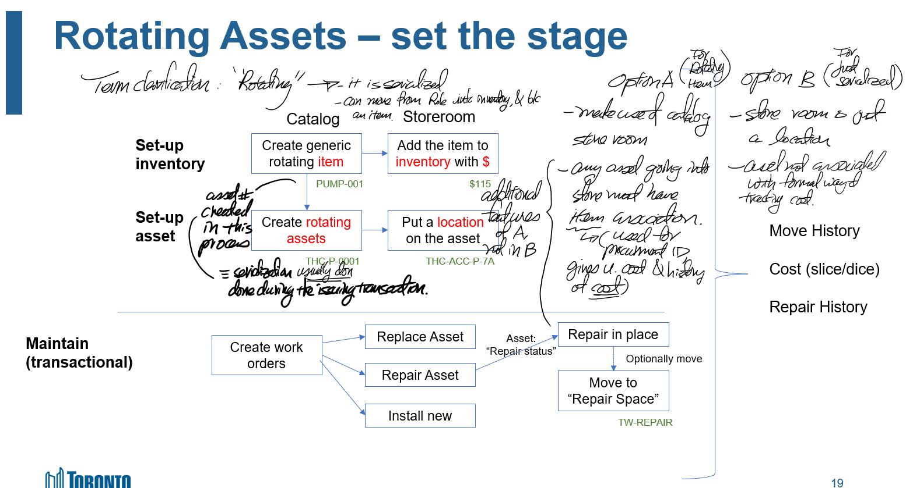

### [[🤝🏻meeting note]]
initiative::
notable-attendees::
	- ### [[🧠to keep in mind]]: When to use [[rotating asset]] and how to setup a [[storeroom]] #[[inventory]]
	  initiative::
	  keep-until-date::
	  embedded-in-mind:: no
	  review-on-date::
		- Facts about inventory, rotating asset, and serialization to keep in mind
			- any asset going into an inventory must be represented as an item.
			- an item does not have to be serialized, e.g., a bolt. But if it is serialized, then it becomes [[rotating asset]]
			- a [[rotating asset]] is a serialized asset associated with an item definition, i.e. it can be both an asset and an item
			- you can also have a serialized asset not associated with an item definition, this asset cannot be checked into the inventory (b/c no item association) and cannot be called [[rotating asset]].
			- inventory is the only way in Maximo
				- to keep track of cost of material used
				- to know if I have the material to do the job - i.e. planning
			- with inventory, we would also get other useful info, such as cost history, order lead time, and re-ordering trigger.
		- Storeroom Configuration Options Presented by Debbie
			- Option A:
				- Implement store room / inventory
				- Any asset going into the inventory
					- would then need to be associated with item
					- would be going in with an inventory process
			- Option B:
				- Implement virtual store - i.e. it is just a spatial location.
			- Thoughts an option A an B:
			  background-color:: yellow
				- we need a store for consumable and replacement items (lubricants, filters, small valves, even some common instrumentations parts) used on work orders and would need to be planned, issued, returned, and re-ordered.
				- initially, my instinct is to store larger, more fixed assets in the virtual store under Option B. I was thinking that this may make things less complex (you don't have to create an item description when you are moving a larger asset into the store).  But now I have second thoughts. Creating a separate virtual store would actually make things more complicated. How does staff know when to use one or the other. Also, we do not often remove equipment from operation and check it into the inventory.
	- Note taken during meeting:
		- 
	- For next meeting
		- Establish Kanban timeline for the task.